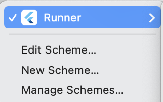
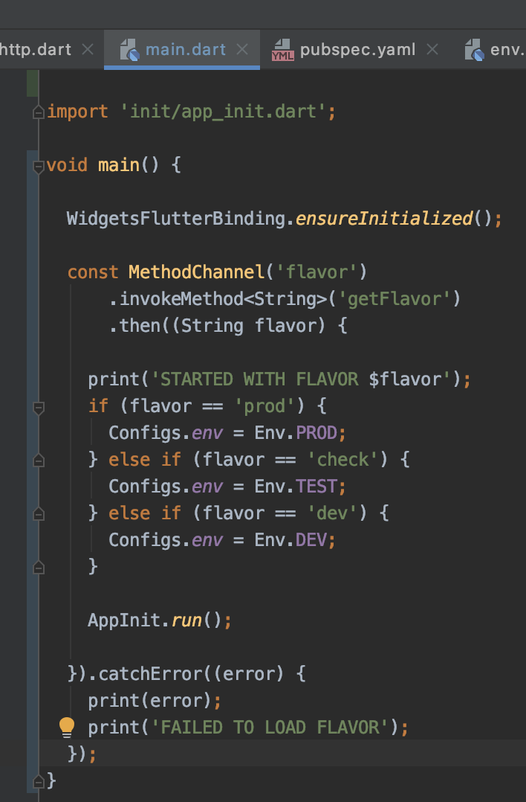

# 最终效果

1. **flutter端**,打开flutter项目,会看到以下三个自定义的选项:

   

2. **安卓端**,打开对应的安卓项目(即打开android文件夹), 会看到Build Variants下,app有多个环境可选, 分别是test环境的profile、release、debug版; dev环境的profile、release、debug版 和 prod环境的profile、release、debug版

   

3. **iOS端**,用xcode打开对应的ios项目,即打开ios文件夹下的Runner.xcworkspace,可以看到3个Scheme..., 每个Scheme各个版(debug、profile、release)都可以配置不同的bundle id, app name、等

   

   

## 开始

这里我为项目添加了3个环境,dev、test和prod,三个环境所用的接口、项目名称、包名、icon不一致

用flutter打开项目,点击如下所示的**Edit Configurations**,创建3个name分别为dev、test、prod, flavor分别为dev、check、prod; (由于test在安卓不能设置为flavor的值,所以这里改成check)


## 为安卓配置环境

在android/app/build.gradle 下添加如下代码:

```
flavorDimensions "appEnvironment"
productFlavors {
check {
            dimension "appEnvironment"
        }

        prod {
            dimension "appEnvironment"
        }

        dev {
            dimension "appEnvironment"
        }
    }
```

目前这里还未设置任何根据环境改变的值,这样就配置好了安卓端的多flavor, 如果要添加包名,项目名等, 就可以在这里设置了,关于更多设置可以网络搜索gradle 配置多渠道,

用安卓打开该项目,就可以看到如下:   在安卓端就可以利用他来实现多环境配置了,接下来配置ios的,都配置好了,再设置具体变量


这个时候执行<u>flutter build apk</u> 是会报错的,如果没有报错,需要执行flutter clean一下,错误如下:


观察该项目build目录下的build/app/outputs/flutter-apk/可以看到会有好几个apk,分别是app-check-release.apk, app-check-release.apk和app-prod-release.apk;   

报错原因:   这是因为flutter build apk会把所有的flavor包都生成, (flutter build apk 不知道版本情况下是默认生成release版本的),所以会看到这3个版本, 但是生成之后,他却不知道用哪个了,所以报错

解决办法:  flutter build apk --flavor dev/check/prod 指定环境; 

## 为iOS配置环境

1. 添加scheme, 名称分别为dev、check、prod

   

   

2.  添加完成可以看到如下:

   

3.  选中PROJECT下的info,找到configurations选择,点击+号, 分别Duplicate 3份 Debug、Release、Profile, 复制之后给每个版的3分更改名称分别为check、dev、prod

   

   

   

4.  之后就可以为每个configurations配置单独的bundle id、证书、签名等信息

   

   

5. 我这里没有更改 bundle id,只是为debug环境和release环境配置了不同的签名,所以最后看到的效果如下:

    

6. 除此之外,Podfile还需要更改如下位置: 

   原来的: 

   更改后为: 

   

此时可以删掉原来默认的runner的scheme, 和Debug、Profile、Release三个默认configurations

之后执行pod install, 就会看到, Pod的PROJECT下的info多出了如下内容: 


以上,ios和安卓配置多环境就完成了,接下来就是利用多环境实现自定义需求了,比如更改请求api,更改包名

## 从flutter端获取当前环境

### ios端

在info.plist 文件添加一条key为Flavor, value为$(PRODUCT_FLAVOR),如下:


之后来到Runner下的Build Setting, 选择Add User-Defined Setting,


为每个configuration添加值


写一个channel, 以供flutter方获取ios的flavor值

打开appdelegate,添加如下代码, 我这里是swift语言,用oc语言的,翻译成oc语言就可以


```
let channelName = "flavor"
    let rootViewController : FlutterViewController = window?.rootViewController as! FlutterViewController
    let methodChannel = FlutterMethodChannel(name: channelName, binaryMessenger: rootViewController as! FlutterBinaryMessenger)
    
    methodChannel.setMethodCallHandler {(call: FlutterMethodCall, result: FlutterResult) -> Void in
        result(Bundle.main.infoDictionary?["Flavor"])
    }
```

### 安卓端

在mainActivity里添加如下代码


```
MethodChannel(flutterEngine.dartExecutor.binaryMessenger, "flavor").setMethodCallHandler { call, result ->  result.success(BuildConfig.FLAVOR) }
```

这里说明一个BuildConfig,这个文件,在选择了flavor后,会自动生成,这里只需要引用一下就可以,


### flutter端通过channel读取环境



```
const MethodChannel('flavor')
      .invokeMethod<String>('getFlavor')
      .then((String flavor) {

    print('STARTED WITH FLAVOR $flavor');
    if (flavor == 'prod') {
       
    } else if (flavor == 'check') {
       
    } else if (flavor == 'dev') {
       
    }

  }).catchError((error) {
    print(error);
    print('FAILED TO LOAD FLAVOR');
  });
```

这样就拿到了当前运行环境,flutter也可以设置自己的一些设置


以上,就完成了,之后运行打包,只要选择对应configuration就可以,命令行需要指定flavor, 比如:   和  

```
flutter build apk --flavor dev 
```

```
flutter build ios --flavor dev
```


更多资料  [配置 flavors 构建双端](https://flutter.cn/docs/deployment/flavors)   

博客地址: [csdn](https://blog.csdn.net/ai_pple/article/details/112009087)

GitHub: [flutter_muti_env](https://github.com/hellozsh/flutter_muti_env.git)

